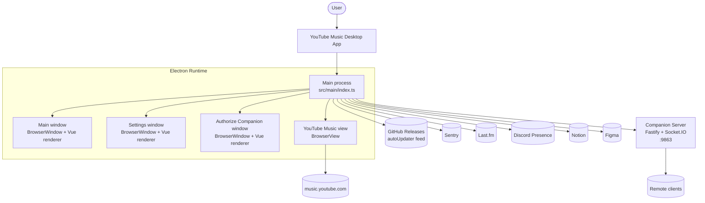
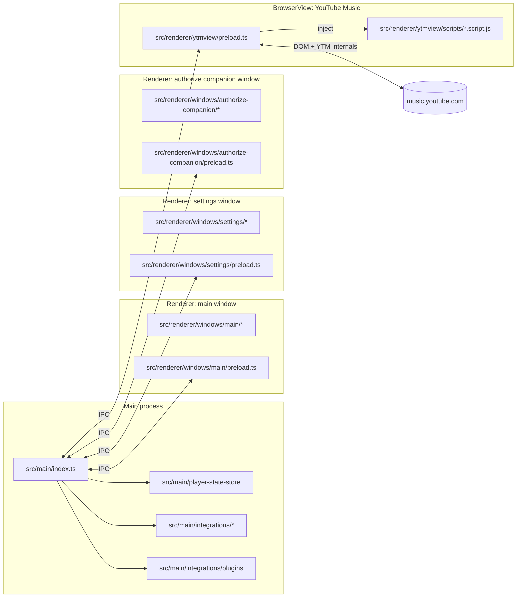
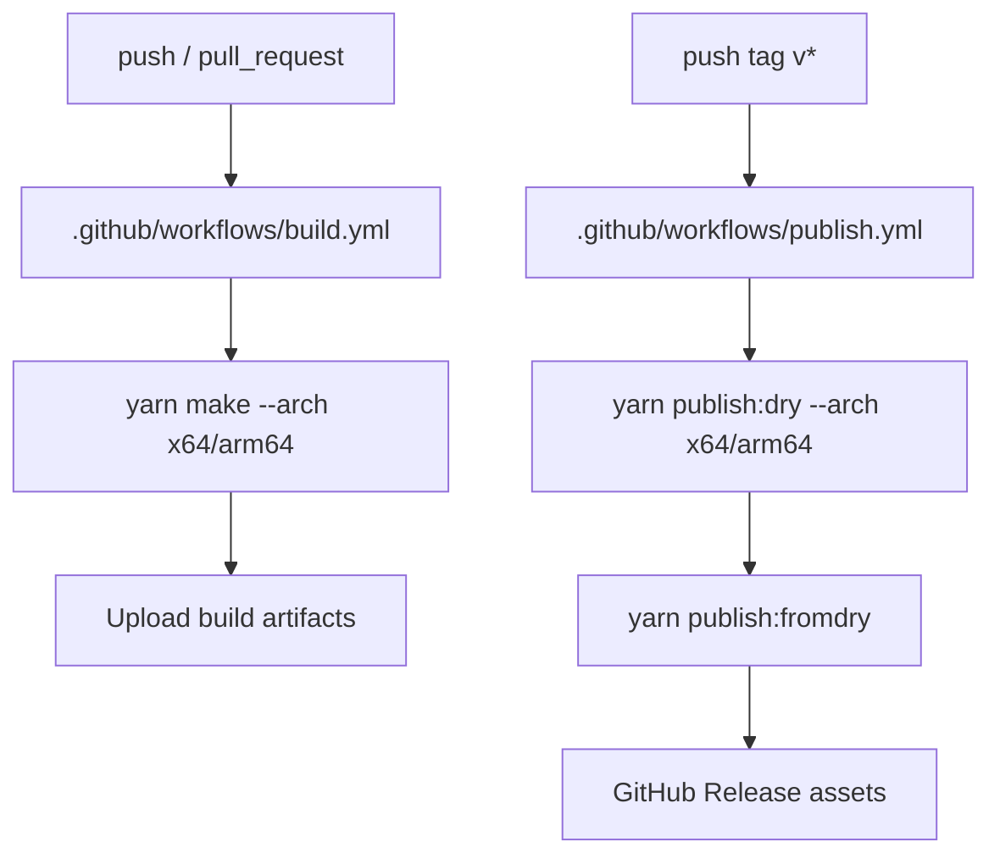
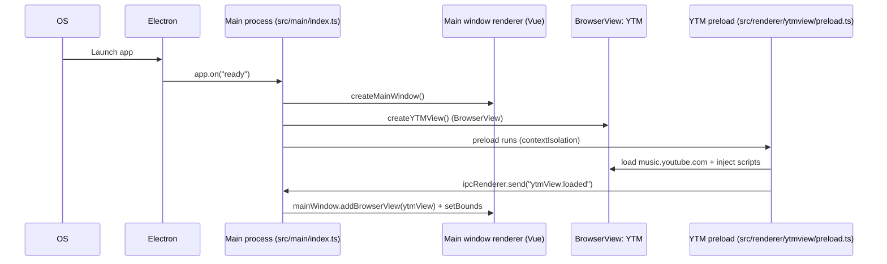
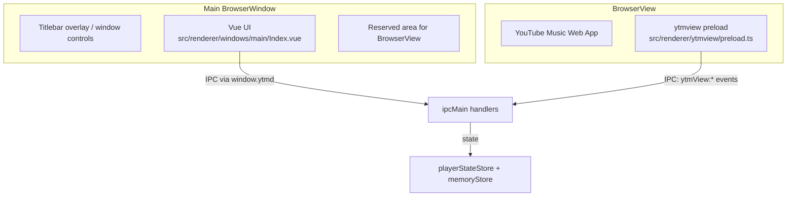
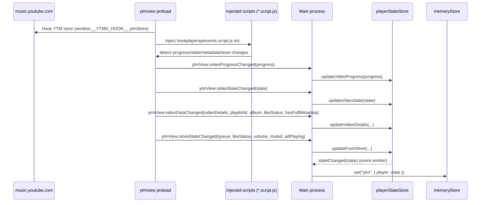
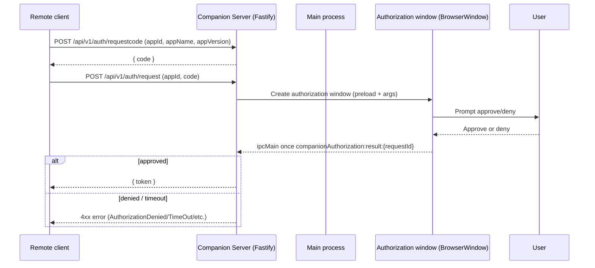
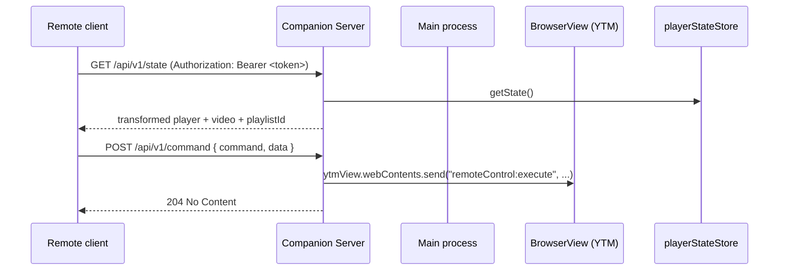
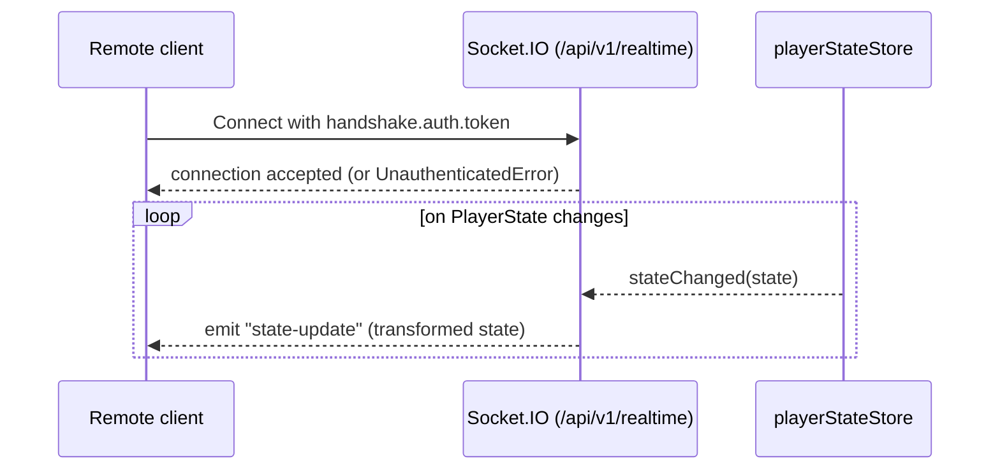
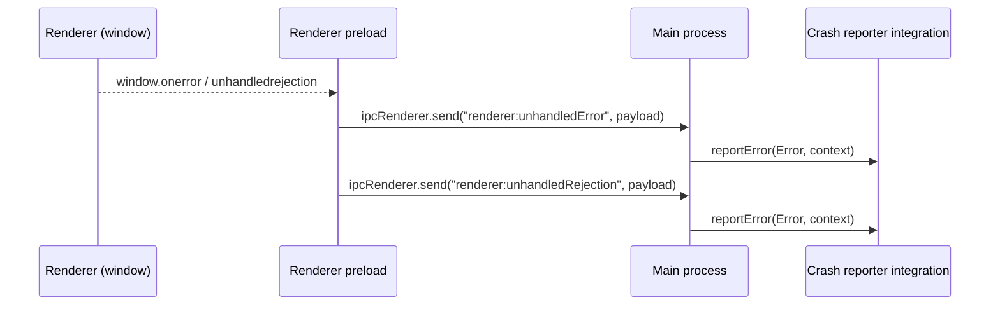

# Project Workflows (Generic → Detailed)

This document explains how this project runs and ships, starting at a system level and drilling down into the concrete event/data flows used in the codebase.

## Big picture

At runtime this is an **Electron** app with:

- **Main process**: owns windows/views, IPC routing, background integrations, persistence (`conf`), and the embedded YouTube Music view.
- **Renderer processes**: Vue UI for the main window + settings + authorization window.
- **BrowserView (YouTube Music)**: loads `music.youtube.com` and is “bridged” into the app via a dedicated preload that injects scripts and forwards player state back to the main process.

### System context diagram



### Process model (what runs where)



## Build & release workflows (generic)

This repo uses **Electron Forge** + the **Forge Vite plugin**.

- **Dev run**: `yarn start` → `electron-forge start`
- **Package**: `yarn package` → `electron-forge package`
- **Make installers/artifacts**: `yarn make` → `electron-forge make`
- **Publish**: `yarn publish` (or the CI tag workflow uses `publish:dry` then `publish:fromdry`)

### Build pipeline (local + CI)

```mermaid
flowchart TD
  dev[Developer / CI runner] --> yarn[yarn]
  yarn --> forge[electron-forge]
  forge --> vite[Vite (Forge Vite plugin)]

  vite --> mainBuild[Build main<br/>entry: src/main/index.ts<br/>out: .vite/main]
  vite --> preloadBuild[Build preloads<br/>entries: windows/*/preload.ts + ytmview/preload.ts<br/>out: .vite/renderer/...]
  vite --> rendererBuild[Build renderers<br/>inputs: src/renderer/windows/*/index.html<br/>out: .vite/renderer]

  forge --> make[Make artifacts<br/>Squirrel/ZIP/DEB/RPM]
  make --> outdir[out/make/...]
```

### CI workflows (GitHub Actions)



## Deployment “builder config” resolution

Some build runners use `builder.config*.json` to locate a companion server (`serverUrl`) and related settings. Resolution is performed by `.scripts/resolve-builder-config.mjs`.

### Config selection logic

```mermaid
flowchart TD
  start([Start]) --> cfgFile{BUILDER_CONFIG_FILE set?}
  cfgFile -- Yes --> useExplicit[Use that path]
  cfgFile -- No --> env{NODE_ENV}
  env -- production --> prod[builder.config.production.json]
  env -- staging --> stag[builder.config.staging.json]
  env -- other/undefined --> local[builder.config.local.json]

  prod --> resolve[Resolve serverUrl]
  stag --> resolve
  local --> resolve

  resolve --> override{BUILDER_SERVER_URL set?}
  override -- Yes --> serverUrl[serverUrl = BUILDER_SERVER_URL (ensure trailing /)]
  override -- No --> expand[Expand ${VAR} and ${VAR:-default}]
  expand --> validate{Valid URL?}
  validate -- Yes --> serverUrl
  validate -- No --> fallback[Fallback: http://localhost:9863/]

  serverUrl --> write[Write builder.config.resolved.json]
  write --> done([Done])
```

## Runtime workflows (generic)

### App startup lifecycle (high level)



### Window & view composition (main window + embedded BrowserView)



## Runtime workflows (detailed)

### 1) Main window UI ↔ main process (IPC bridge)

The main window’s preload exposes a typed-ish `window.ytmd` bridge that forwards UI actions to `ipcMain` handlers (window controls, opening settings, focusing, update checks, etc.).

```mermaid
sequenceDiagram
  participant UI as Vue UI (renderer)
  participant P as Main preload (src/renderer/windows/main/preload.ts)
  participant M as Main process (src/main/index.ts)

  UI->>P: window.ytmd.openSettingsWindow()
  P->>M: ipcRenderer.send("settingsWindow:open")
  M->>M: createOrShowSettingsWindow()

  UI->>P: window.ytmd.ytmViewRecreate()
  P->>M: ipcRenderer.send("ytmView:recreate")
  M->>M: cleanupYTMView(); createYTMView()
```

### 2) YTM view hook + player state propagation

The YouTube Music BrowserView preload (`src/renderer/ytmview/preload.ts`) does three core jobs:

- **Hook** the internal YTM store (via a `Reflect.decorate` interception).
- **Inject** scripts (`src/renderer/ytmview/scripts/*.script.js`) to subscribe to player/store events.
- **Forward** changes to the main process via IPC (`ytmView:*` channels).

Main process updates the canonical `playerStateStore`, and also mirrors it into `memoryStore` (used by integrations like the companion server).



### 3) Companion Server: API + auth + realtime updates

The companion server runs inside the main process as a Fastify server with Socket.IO:

- **Host/port**: `0.0.0.0:9863`
- **HTTP API**: under `/api/v1/*`
- **Realtime namespace**: `/api/v1/realtime`

#### 3.1 Auth flow (request code → request token → store token)



#### 3.2 State & command flow (HTTP)



#### 3.3 Realtime state updates (websocket)



### 4) Plugin lifecycle (built-in plugins)

Plugins are managed by `PluginManager` (`src/main/integrations/plugins/index.ts`) using a dedicated `conf` store (`plugins.json` in `userData`).

```mermaid
flowchart TD
  subgraph Startup
    start([App starts]) --> pmNew[PluginManager created]
    pmNew --> reg[registerBuiltinPlugins()]
    reg --> load[loadPluginSettings() from Conf store]
    load --> auto[autoEnablePlugins()]
    auto --> ready[pluginManager.onAppReady()]
  end

  subgraph Plugin Enable/Disable
    toggle[User toggles plugin in UI] --> ipc[ipcMain.handle("plugins:toggle")]
    ipc --> en{Toggle enabled?}
    en -- "Enable" --> onEnable[plugin.onEnable()\nsetEnabled(true)\npersist to settings]
    en -- "Disable" --> onDisable[plugin.onDisable()\nsetEnabled(false)\npersist to settings]
  end
```

### 5) Error reporting & crash reports (renderer → main → crash reporter)

The main window preload installs global handlers for uncaught errors and unhandled promise rejections and forwards them to the main process. The main process then routes them into the crash reporter integration.



## “Where do I look?” index

- **Main runtime entry**: `src/main/index.ts`
- **Player state canonical store**: `src/main/player-state-store/index.ts`
- **Main window preload bridge**: `src/renderer/windows/main/preload.ts`
- **YTM BrowserView preload (hook/injection/IPC)**: `src/renderer/ytmview/preload.ts`
- **YTM injected scripts**: `src/renderer/ytmview/scripts/*.script.js`
- **Companion server**: `src/main/integrations/companion-server/*`
- **Plugins**: `src/main/integrations/plugins/*`
- **Build config**: `forge.config.ts`, `viteconfig/*`, `.github/workflows/*`
